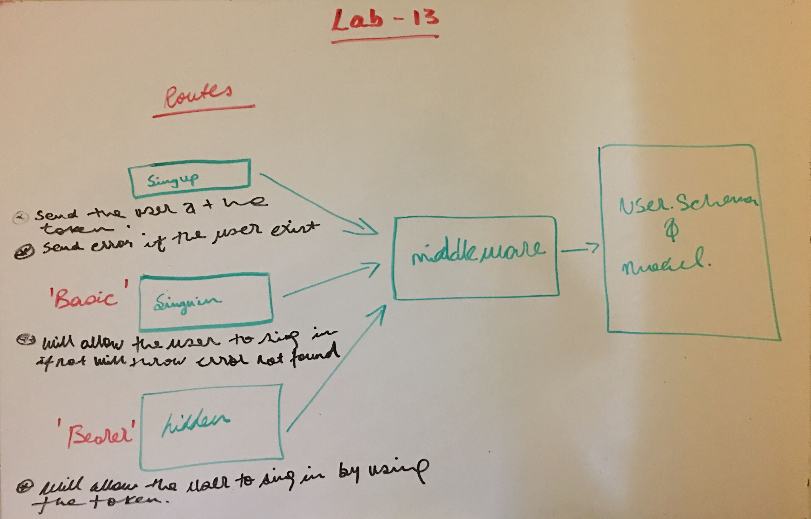

## LAB - Class 13

* Author: Eyob Tamir

### Links and Resources
[submission PR link] () 

### back-end server url (when applicable)
* http//:localhosts:3000  - for home page *
* http://localhost:3000/api/v1/users- will populate the users data.

### Heroku Link home Page
*http://lab-13-bearer-basic.herokuapp.com/*

### Swagger on Heroku Link
*http://lab-13-bearer-basic.herokuapp.com/api-docs*

### Setup
* .env requirements *
 * For MONGO_URI *
 * PORT * 
 * SECRET *

### PORT - Port Number
    PORT-3000

### How to initialize/run your application 
 `npm start` || `nodemon`

### Tests
* jest --verbose --coverage
* npm test lab-13

UML
